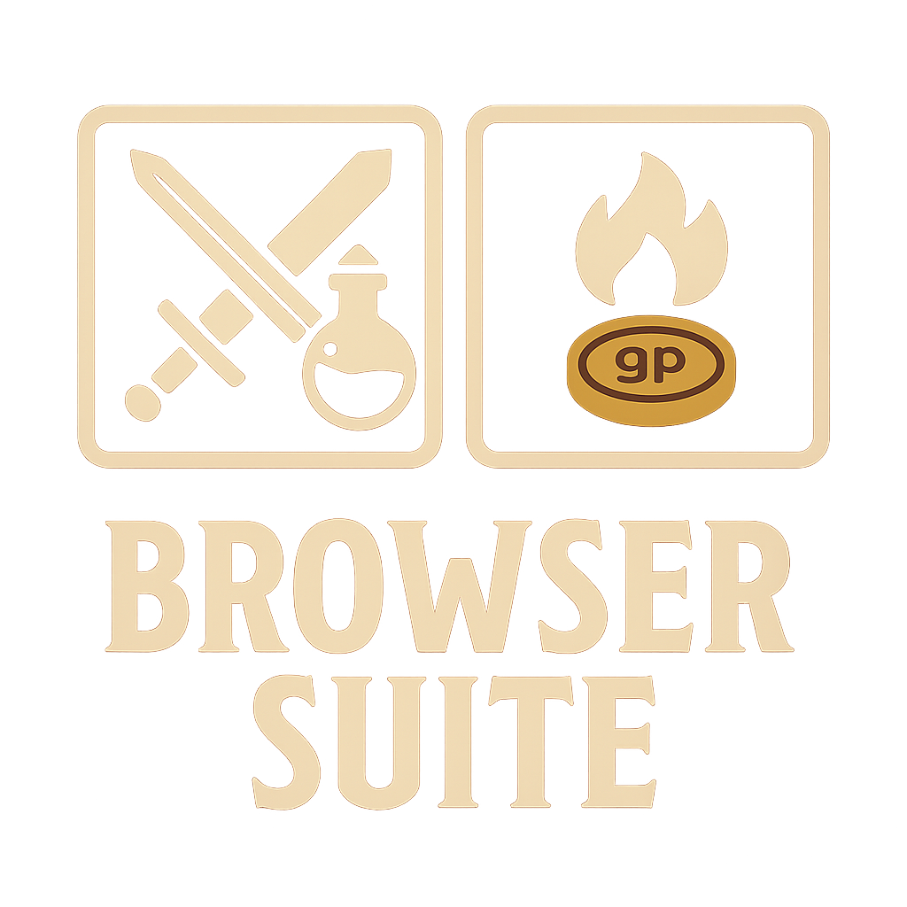

# DnD5e Physical Items Browser



A lightweight, theme‑accurate enhancement for the DnD5e system that adds a clean, modern, sheet‑native interface for browsing, selecting, and adding physical items to an actor. Designed to feel like a natural extension of the official DnD5e UI.

This module focuses on clarity, immersion, and minimalism — no bloat, no feature creep, just a polished workflow for adding equipment, gear, consumables, tools, ammo, and containers.

---

## ✨ Features

### 🛒 Buy Mode / Free Mode
- Toggle between **Buy Mode** (subtracts currency) and **Free Mode** (adds items without cost).
- Uses a DnD5e‑style slide toggle with a clear mode label.

### 📦 Category Grouping
Items are automatically grouped into:
- Weapons  
- Armor  
- Tools  
- Adventuring Gear  
- Consumables  
- Ammunition  
- Containers  
- Miscellaneous  

Each group has a **DnD5e‑style gradient header** with embedded column labels.

### 📋 Column‑Aligned Layout

- Checkbox for selection  
- Item block with image + name + type  
- Quantity widget (with +/– buttons)  
- Cost badge  

### 🔢 Quantity Widget
- Actor‑sheet‑style quantity control  
- Supports typing or clicking  
- Auto‑updates total cost  

### 💰 Currency Validation
In Buy Mode:
- Calculates total cost in copper  
- Converts actor currency to copper  
- Prevents purchase if insufficient funds  
- Updates actor currency on success  

### 📥 Multi‑Item Add
Adds all selected items at once, preserving:
- Quantity  
- Item data  
- Item type  

---

## 🧪 Compatibility

- FoundryVTT 13+
- DND5e 5.x.x
- Fully theme‑compatible (light/dark/custom themes) 

---

## 📦 Installation

### Option 1: Manual Download
1. Download the ZIP from [GitHub](https://github.com/SlamHammerfist/Item-Browser/archive/refs/heads/main.zip)
2. Extract into your `modules` folder

### Option 2: Manifest Link
1. Paste this into FoundryVTT's "Install Module" field:
   ```json
   https://raw.githubusercontent.com/SlamHammerfist/Item-Browser/refs/heads/main/module.json
2. Enable Item Browser in your world

---

## 🛠️ Usage

1. Open an actor sheet.  
2. Trigger the Physical Items Browser on Items Tab.
3. Select items using the checkboxes.  
4. Adjust quantities.  
5. Choose **Buy Mode** or **Free Mode**.  
6. Confirm to add items to the actor.

---

## 🤖 AI Usage

This module was developed with assistance from Microsoft Copilot, with extensive testing, iteration, and architectural decisions made by 
the author.